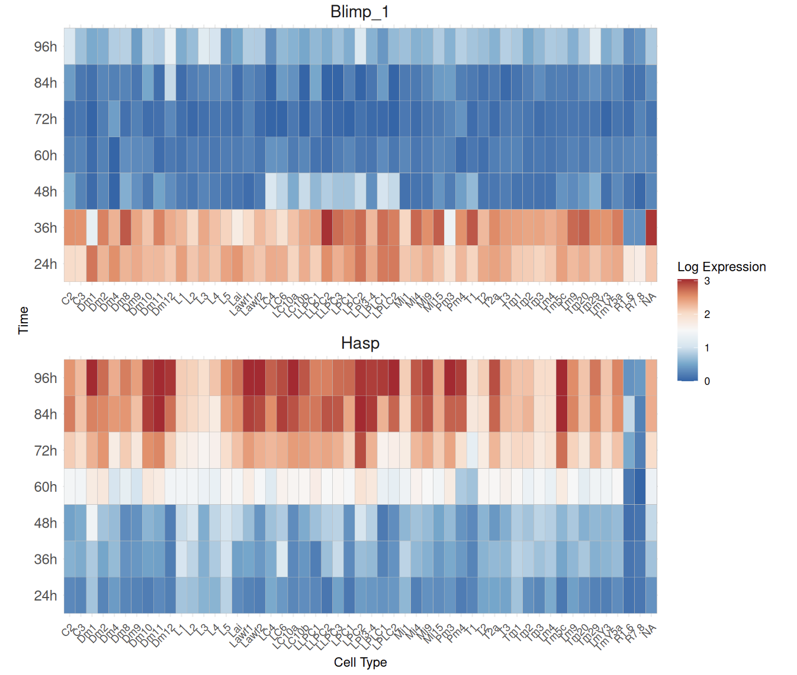

# Shiny server

This a a shiny server displaying the temproal scRNA-seq data of developing drosophila brains published in the paper ["Transcriptional Programs of Circuit Assembly in the Drosophila Visual System" ](https://www.cell.com/neuron/fulltext/S0896-6273(20)30774-1?dgcid=raven_jbs_aip_email). 

#maintanace information:
Server hosted with AWS EC2 platform

